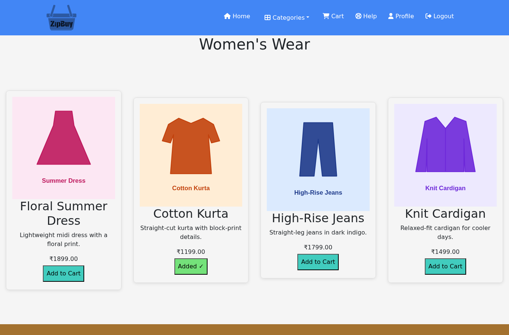
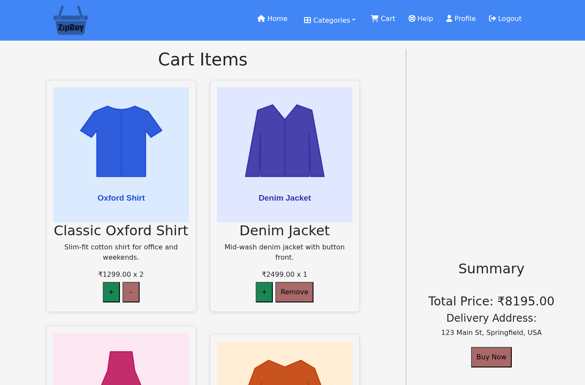
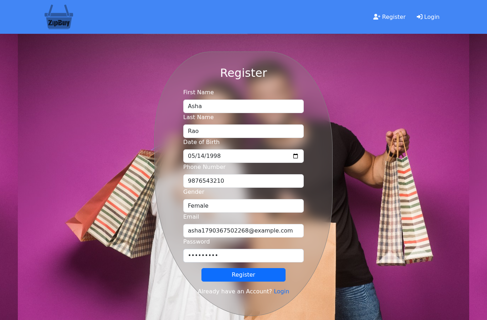
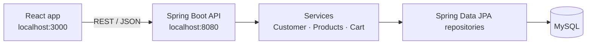

# ZipBuy — Full-Stack E-Commerce App

An online clothing store with a **Spring Boot (Java 21)** REST API and a **React** frontend.
Customers can register, log in, browse products by category, manage a shopping cart and check
out.


| Category page                                   | Cart                                | Registration                                   |
| ----------------------------------------------- | ----------------------------------- | ---------------------------------------------- |
|  |  |  |

## Features

- **Accounts**: registration with validation, login, and a profile page. Passwords are hashed
  with BCrypt and never returned by the API.
- **Catalogue**: products grouped into men's, women's and kids' wear, with a home page preview of
  each category.
- **Cart**: add products, change quantities (up to 5 per item) and remove items. The cart is
  stored on the server, so it survives page reloads.
- **Checkout**: order summary and a payment form with card validation.
- **Demo data**: an empty database is filled with sample categories and products on first start,
  so the shop works right after cloning.

## Tech stack

| Layer    | Technologies                                                                  |
| -------- | ----------------------------------------------------------------------------- |
| Backend  | Java 21, Spring Boot 3.3 (Web, Data JPA, Validation), Spring Security Crypto |
| Database | MySQL 8 (H2 in tests)                                                         |
| Frontend | React 18, React Router 6, React Bootstrap, Axios, Swiper                      |
| Testing  | JUnit 5, Spring MockMvc, Jest, React Testing Library                          |
| DevOps   | Maven wrapper, Docker Compose, GitHub Actions                                 |

## Architecture



```text
backend/src/main/java/com/ecommerce/backendspring/
├── controller/   # REST endpoints
├── service/      # Business logic: registration and login, catalogue, cart
├── repository/   # Spring Data JPA repositories
├── model/        # JPA entities: Customer, Product, Category, Gallery, Cart, Coupon
├── dto/          # Request and response objects
├── exception/    # Typed exceptions and the global error handler
└── config/       # CORS and password hashing

frontend/src/
├── components/   # Pages and UI: ProductList, Cart, Login, Register, Profile, Payment …
├── config.js     # API base URL and category definitions
└── styles/
```

## Getting started

### Option 1: Docker (recommended)

Requires Docker.

```bash
docker compose up --build
```

Then open http://localhost:3000. This starts MySQL, the API and the React app.

### Option 2: Run locally

Requires Java 21, Node.js 18+ and a MySQL database.

```bash
# Backend
cd backend
export DB_URL=jdbc:mysql://localhost:3306/e_commerce DB_USERNAME=<user> DB_PASSWORD=<password>
./mvnw spring-boot:run            # API at http://localhost:8080

# Frontend (in a second terminal)
cd frontend
npm install
npm start                         # app at http://localhost:3000
```

| Environment variable | Default                                  | Used for                          |
| -------------------- | ---------------------------------------- | --------------------------------- |
| `DB_URL`             | `jdbc:mysql://localhost:3306/e_commerce` | Database connection               |
| `DB_USERNAME`        | `zipbuy`                                 | Database user                     |
| `DB_PASSWORD`        | `zipbuy`                                 | Database password                 |
| `FRONTEND_URL`       | `http://localhost:3000`                  | Origin allowed by CORS            |
| `SEED_DEMO_DATA`     | `true`                                   | Insert demo products              |
| `REACT_APP_API_URL`  | `http://localhost:8080`                  | API address used by the React app |

## API

| Method | Path                                                | Description                         |
| ------ | --------------------------------------------------- | ----------------------------------- |
| POST   | `/api/register`                                     | Create a customer account           |
| POST   | `/api/login`                                        | Check email and password            |
| GET    | `/api/customer/profile?email=`                      | Customer profile                    |
| GET    | `/api/products/products`                            | All products                        |
| GET    | `/api/products/category/{name}`                     | Products in a category              |
| POST   | `/api/products/create`                              | Add a product                       |
| GET    | `/api/cart/products/{email}`                        | Items in a customer's cart          |
| POST   | `/api/cart/add?customerEmail=&productId=&quantity=` | Add a product to the cart           |
| PUT    | `/api/cart/update`                                  | Set a quantity (0 removes the item) |
| POST   | `/api/cart/remove?customerEmail=&productId=`        | Remove a product from the cart      |

Errors are returned as JSON with a matching status code, for example
`{"success": false, "status": 404, "message": "Product not found: 99"}`.

## Testing

```bash
cd backend && ./mvnw test                     # API integration tests (H2, no MySQL needed)
cd frontend && npm test -- --watchAll=false   # React component tests
```

The backend tests cover registration and login (including that passwords are hashed and never
returned), duplicate emails, product listing, and the full cart flow. The frontend tests cover
loading products, the category preview, and adding to the cart.

## Roadmap

- Token-based authentication (JWT) instead of keeping the email in the browser
- Order history and saved delivery addresses
- Admin screens for managing products
- Payment gateway integration
